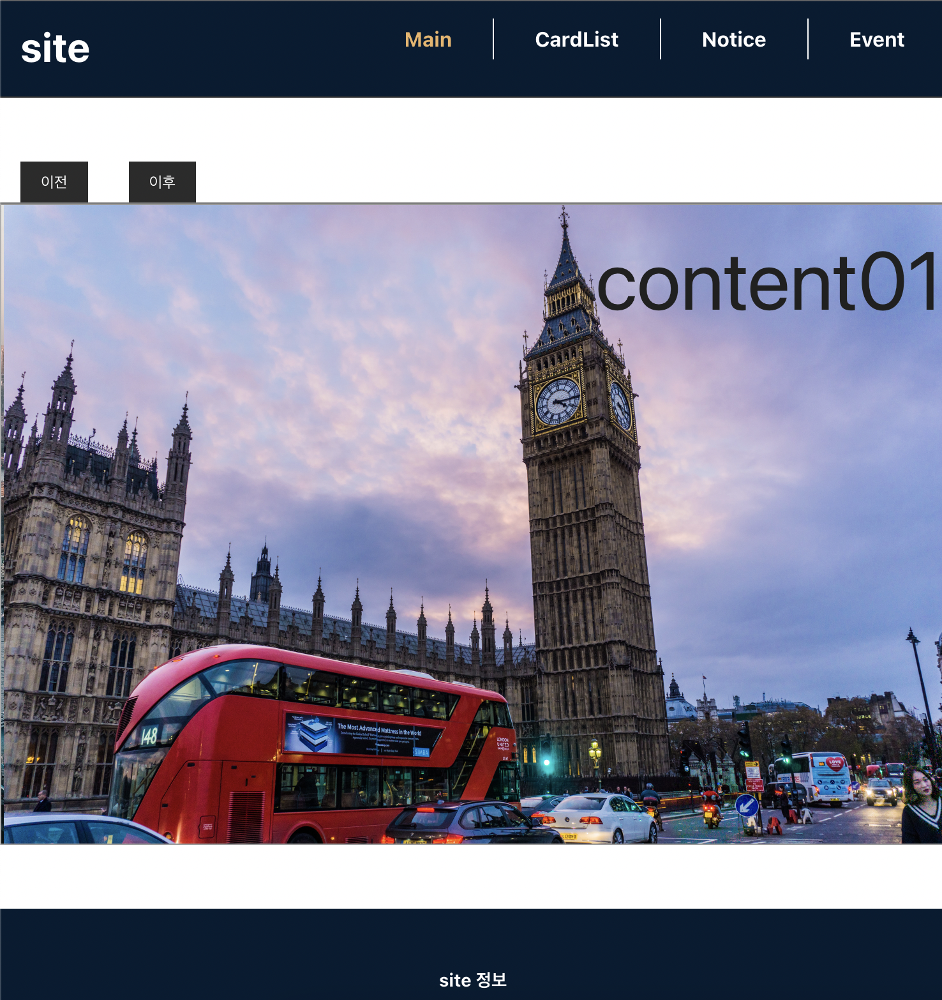
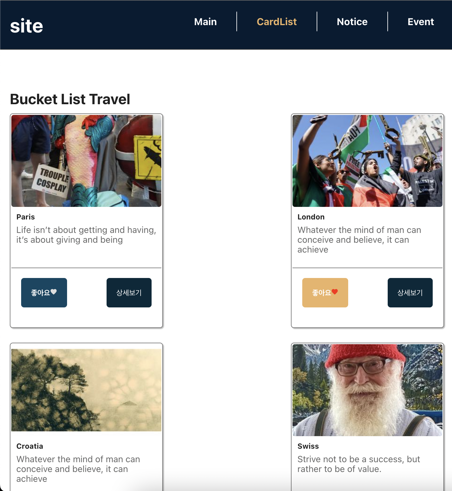

# 💻Project

SeSAC 산업진흥원 프론트엔드 실무 교육과정에서 **REACT를 기반으로 한 MINI BLOG**을 통해 이미지 슬라이드,카드리스트,좋아요 기능,라우팅 을 구현하였습니다.

# 🪜Architecture
src  
 ┣ components  
 ┃ ┣ Card.jsx  
 ┃ ┣ CardList.jsx  
 ┃ ┣ Event.jsx  
 ┃ ┣ EventItem.jsx  
 ┃ ┣ EventToggle.jsx  
 ┃ ┣ Footer.jsx  
 ┃ ┣ Header.jsx  
 ┃ ┣ Main.jsx  
 ┃ ┣ Nav.jsx  
 ┃ ┗ Notice.jsx  
 ┣ pages  
 ┃ ┗ FooterMenu.jsx  
 ┣ style  
 ┃ ┣ container.css  
 ┃ ┣ event.module.css  
 ┃ ┣ footer.css  
 ┃ ┣ footerMenu.css  
 ┃ ┣ header.css  
 ┃ ┣ main.css  
 ┃ ┗ manual.module.css  
 ┣ App.css  
 ┣ App.js  
 ┣ App.test.js  
 ┣ index.css  
 ┣ index.js  
 ┣ logo.svg  
 ┣ reportWebVitals.js  
 ┗ setupTests.js

# 🚀Result

# 💡Review

- 라이브러리를 사용하지 않고도 **@keyframes과 animation** 활용하여 슬라이드 구현하게 되었습니다.
- **useState와 삼항연산자** 활용하여 좋아요 버튼 구현하는 방법을 배웠습니다.
- **react-router-dom**을 사용하여  새로고침 없이 URL 주소에 따라 각 메뉴 페이지로 최적화된 렌더링이 가능하다는 것을 경험했습니다.
- **useEffect**을 사용하여 **axios get** 메소드를 통해 가상 data를 가져와 리스트에 데이터를 불러오는 방법을 배웠습니다.